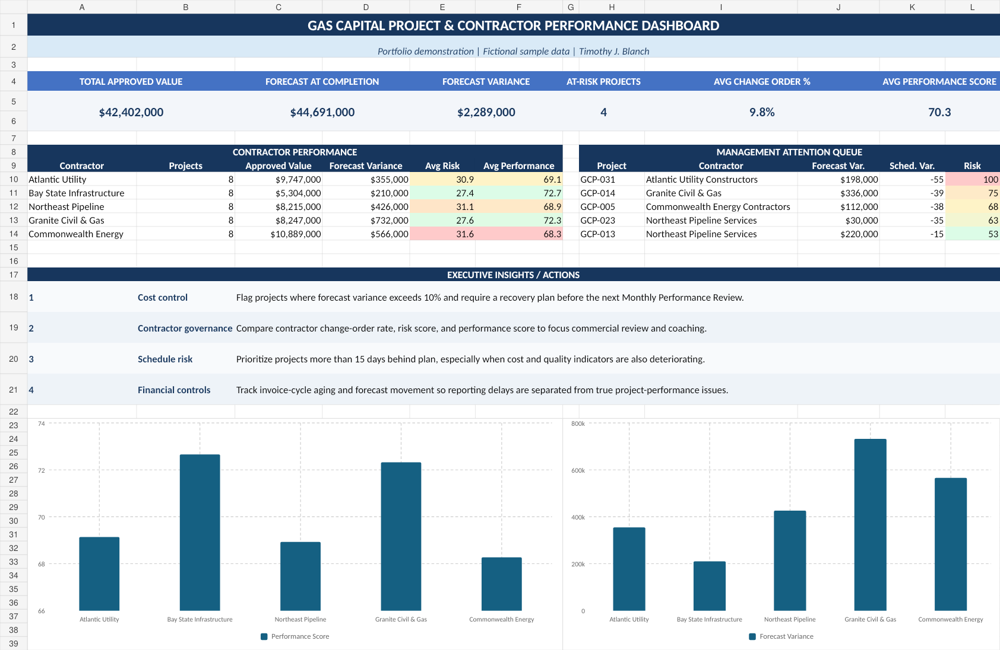

# gas-contract-analytics-portfolio
Capital project and contractor performance analytics portfolio using Excel, SQL, KPI reporting, and Power BI concepts.

## Gas Capital Project & Contract Analytics Portfolio

This project simulates a gas infrastructure capital project portfolio and demonstrates how project and contract performance data can be transformed into actionable management insights.

## Business Objective

Provide project managers and contract management leadership with visibility into financial performance, contractor performance, schedule risk, change orders, and projects requiring management attention.

## Portfolio Scope

- 40 simulated gas capital projects
- Approximately $42.4 million in approved contract value
- Multiple contractors and project types
- Cost, forecast, schedule, change-order, and contractor-performance metrics

## Tools & Skills Demonstrated

- Microsoft Excel
- Data analysis
- KPI development
- SQL concepts
- Power BI reporting concepts
- Executive reporting
- Cost variance analysis
- Contractor scorecards
- Risk identification

## Key Analyses

- Approved contract value vs. forecast at completion
- Cost variance percentage
- Change-order percentage
- Schedule variance
- Contractor performance
- Exception reporting
- Management-attention identification

## Project Purpose

I created this project to develop practical experience applying financial and operational analytics to utility infrastructure and contract management. The goal was to move beyond simply reporting data and instead identify trends, exceptions, and risks that could help project and contract managers make better decisions.

## Data Disclaimer

All project and contractor data used in this portfolio is fictional and was created solely for professional development and demonstration purposes. This project contains no National Grid or other proprietary utility information.

## Executive Dashboard

## Project Files

The complete supporting files for this portfolio are available in this repository:

- **Excel Analytics Workbook** — Full simulated project dataset, KPI calculations, contractor scorecards, exception reporting, and dashboard analysis.
- **Executive Project Brief** — One-page summary of the project's business objective, methodology, KPIs, and key findings.

## What I Learned

This project strengthened my understanding of how financial, schedule, and contractor-performance data can be used to identify risks and support decision-making on capital projects. I focused on turning raw project information into concise management reporting rather than simply presenting data.
